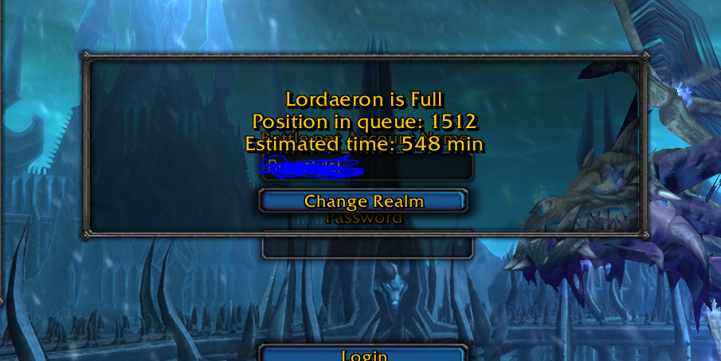

### Implementacja protokołu uwierzytelniania SRP-6a ###

* Protokół wykorzystywany przez serwer uwierzytelniania gry World of Warcraft stworzony przez Blizzard Entertainment
* Miks implementacji SRP-6a przedstawionego w [RFC 5054](https://www.rfc-editor.org/rfc/rfc5054) oraz SRP-3 opisanego w [RFC 2945](https://www.rfc-editor.org/rfc/rfc2945)
* Projekt stworzony w związku z wybuchem pandemii i powstającymi z tego powodu dużymi kolejkami do gry na prywatnym serwerze Warmane
* Pozwala na pomyślne przejście uwierzytelniania - serwer odsyła adres IP serwera gry oraz session key, który jest używany do dalszej komunikacji z serwerem gry
* Komunikacja z serwerem gry wymaga dodatkowych kluczy losowanych podczas uruchomienia klienta gry
* Bez inżynierii wstecznej klienta gry nie udało się odkryć algorytmu losowania kluczy, a co za tym idzie komunikować się z serwerem z pominięciem klienta

## POV: ja z ziomkami ;) ##

